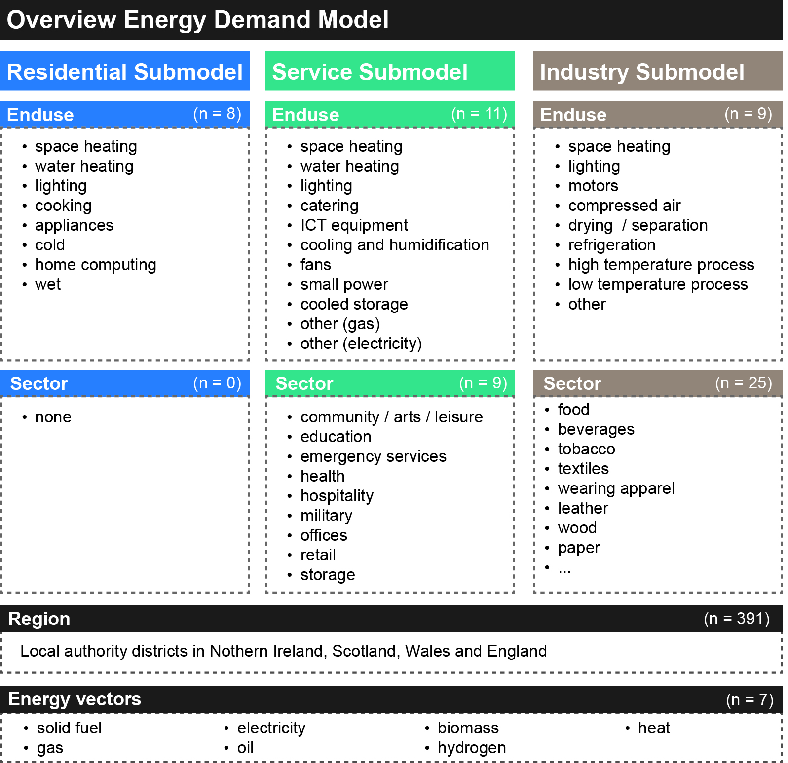
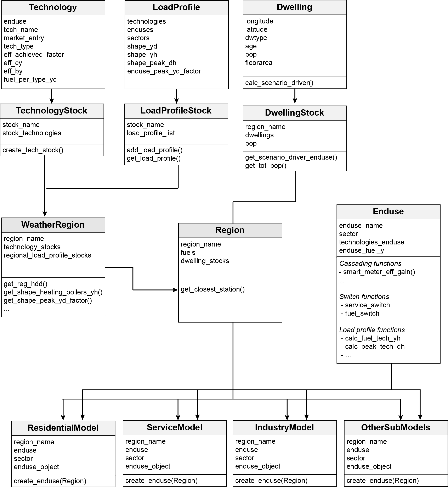
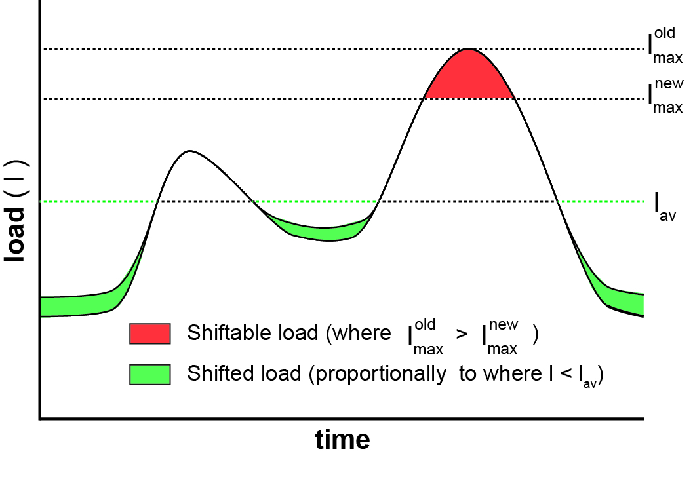
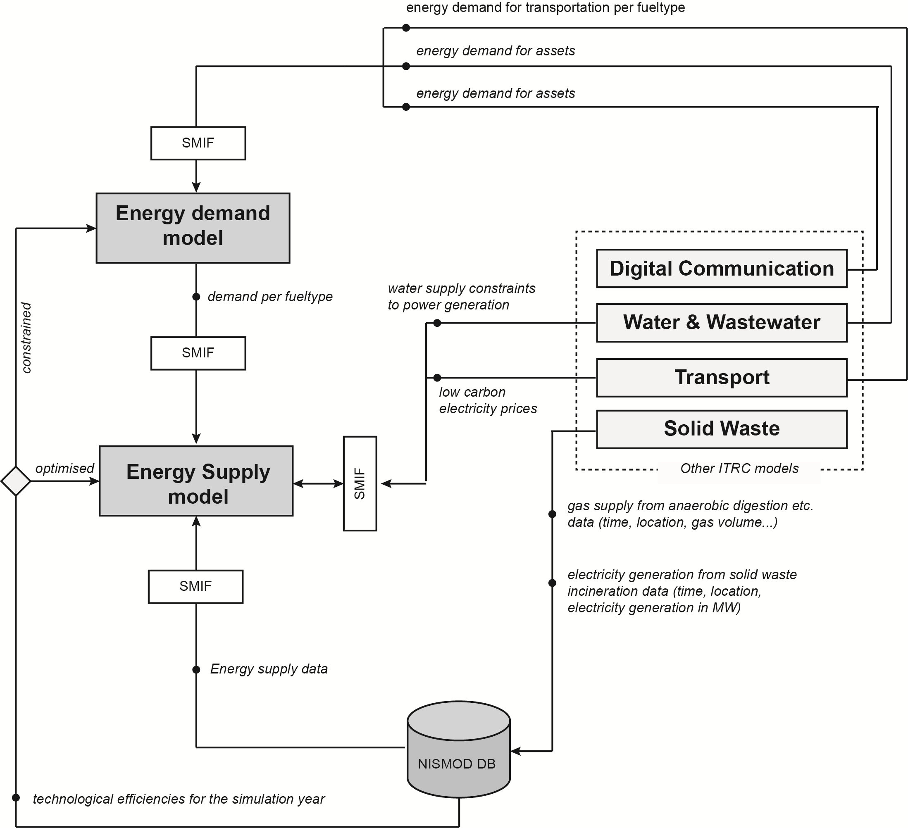
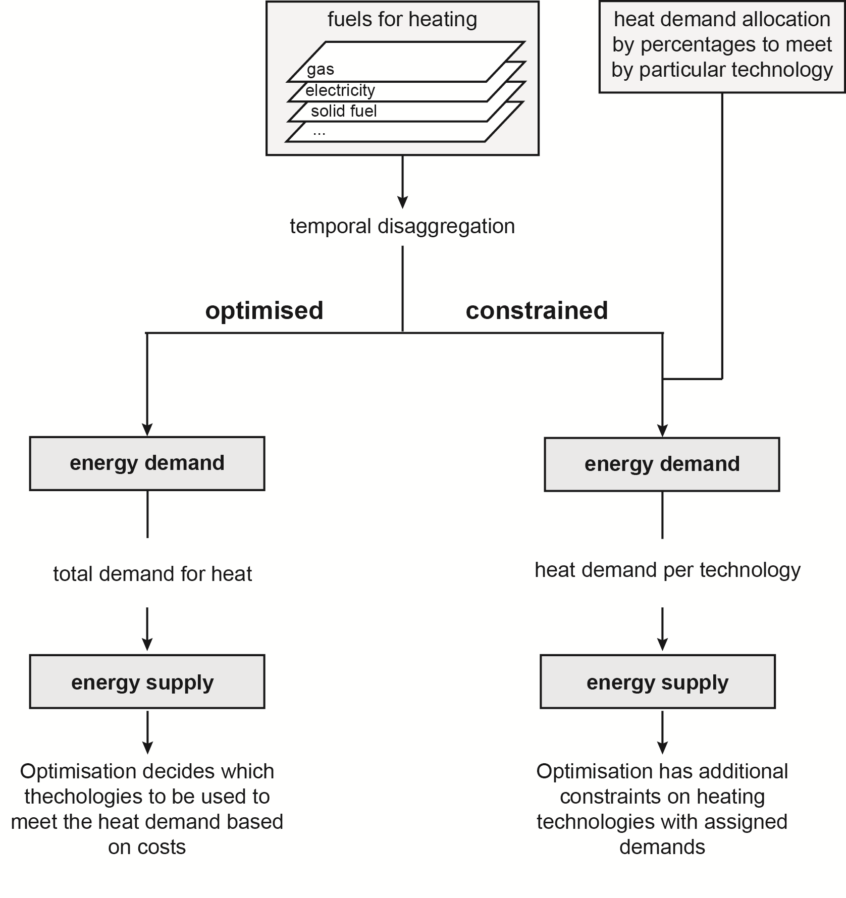

Documentation
===================

## 1. Introduction

The energy demand model of the ITRC-MISTRAL framework allows 
the simulation of long-term changes in energy demand patterns
for the residential, service and industry sector on a high temporal
and spatial scale. National end-use specific energy demand data is
disaggregated on local authority district level and a bottom-up approach
is implemented for hourly energy demand estimation for different fuel types
and end-uses.
Future energy demand is simulated based on different
socio-technical scenario assumptions such as technology efficiencies,
changes in the technological mix per end-use consumptions or behavioural change.
Energy demand is simulated in relation to changes in scenario drivers of the
base year. End-use specific socio-technical drivers for energy demands
are defined and modelled where possible on a household level.

The energy demand model integrates energy demands across
all ITRC models and provides demands to the supply model.

## 2. Overview of model and simulation approach

### 2.1 Modelled end uses and sectors

The energy demand model create of three main submodules which model
residential, service and industrial energy demand. Each submodule
modelles end uses and sectors (see Figure 2.1 and Table 2.1).

*Figure 2.1: Overview of modelled end uses and sectors*

<table align="center">
  <tr>
    <th align="left">Residential Submodel</th>
    <th align="left">Service Submodel</th>
    <th align="left">Industry Submodel</th>
  </tr>
  <tr>
    <td>&nbsp</td>
    <td>&nbsp</td>
    <td>&nbsp</td>
  </tr>
  <tr>
    <td><b>End use</b></td>
    <td><b>End use</b></td>
    <td><b>End use</b></td>
  </tr>
  <tr>
    <td>space heating</td>
    <td>space heating</td>
    <td>space heating</td>
  </tr>
  <tr>
    <td>water heating</td>
    <td>water heating</td>
    <td>drying and separation</td>
  </tr>
  <tr>
    <td>lighting</td>
    <td>lighting</td>
    <td>lighting</td>
  </tr>
  <tr>
    <td>cooking</td>
    <td>catering</td>
    <td>motors</td>
  </tr>
  <tr>
    <td>cold</td>
    <td>cooling and humidification</td>
    <td>refrigeration</td>
  </tr>
  <tr>
    <td>home computing</td>
    <td>ICT equipment</td>
    <td>compressed air</td>
  </tr>
  <tr>
    <td>consumer electronics</td>
    <td>fans</td>
    <td>high temperature processes</td>
  </tr>
  <tr>
    <td>wet</td>
    <td>small power</td>
    <td>low temperature processes</td>
  </tr>
  <tr>
    <td>&nbsp</td>
    <td>other gas</td>
    <td>other</td>
  </tr>
  <tr>
    <td>&nbsp</td>
    <td>other electricity</td>
    <td>&nbsp</td>
  </tr>
  <tr>
    <td>&nbsp</td>
    <td>cooled storage</td>
    <td>&nbsp</td>
  </tr>
  <tr>
    <td>&nbsp</td>
    <td>&nbsp</td>
    <td>&nbsp</td>
  </td>
  <tr>
    <td><b>Sector</b></td>
    <td><b>Sector</b></td>
    <td><b>Sector</b></td>
  </tr>
  <tr>
    <td>&nbsp</td>
    <td>Community, arts and leisure</td>
    <td>Other mining and quarrying</td>
  </tr>
  <tr>
    <td>&nbsp</td>
    <td>Education</td>
    <td>Manufacture of food products</td>
  </tr>
  <tr>
    <td>&nbsp</td>
    <td>Emergency Services</td>
    <td>Manufacture of beverages</td>
  </tr>
  <tr>
    <td>&nbsp</td>
    <td>Health</td>
    <td>Manufacture of tobacco products</td>
  </tr>
  <tr>
    <td>&nbsp</td>
    <td>Hospitality</td>
    <td>Manufacture of textiles</td>
  </tr>
  <tr>
    <td>&nbsp</td>
    <td>Military</td>
    <td>Manufacture of wearing apparel</td>
  </tr>
  <tr>
    <td>&nbsp</td>
    <td>Offices</td>
    <td>Manufacture of leather and related products</td>
  </tr>
  <tr>
    <td>&nbsp</td>
    <td>Retail</td>
    <td>Manufacture of wood related products</td>
  </tr>
  <tr>
    <td>&nbsp</td>
    <td>Storage</td>
    <td>Manufacture of paper and paper products</td>
  </tr>
  <tr>
    <td>&nbsp</td>
    <td>&nbsp</td>
    <td>Printing and publishing of recorded media and other publishing activities</td>
  </tr>
  <tr>
    <td>&nbsp</td>
    <td>&nbsp</td>
    <td>Manufacture of chemicals and chemical products</td>
  </tr>
  <tr>
    <td>&nbsp</td>
    <td>&nbsp</td>
    <td>Manufacture of basic pharmaceutical products  and pharmaceutical preparations</td>
  </tr>
  <tr>
    <td>&nbsp</td>
    <td>&nbsp</td>
    <td>Manufacture of rubber and plastic products</td>
  </tr>
  <tr>
    <td>&nbsp</td>
    <td>&nbsp</td>
    <td>Manufacture of other non-metallic mineral products</td>
  </tr>
  <tr>
    <td>&nbsp</td>
    <td>&nbsp</td>
    <td>Manufacture of basic metals</td>
  </tr>
  <tr>
    <td>&nbsp</td>
    <td>&nbsp</td>
    <td>Manufacture of fabricated metal products,  except machinery and equipment</td>
  </tr
    <tr>
    <td>&nbsp</td>
    <td>&nbsp</td>
    <td>Manufacture of computer, electronic and optical products</td>
  </tr>
  <tr>
    <td>&nbsp</td>
    <td>&nbsp</td>
    <td>Manufacture of electrical equipment</td>
  </tr>
  <tr>
    <td>&nbsp</td>
    <td>&nbsp</td>
    <td>Manufacture of machinery and equipment n.e.c.</td>
  </tr>
  <tr>
    <td>&nbsp</td>
    <td>&nbsp</td>
    <td>Manufacture of motor vehicles,  trailers and semi-trailers</td>
  </tr>
  <tr>
    <td>&nbsp</td>
    <td>&nbsp</td>
    <td>Manufacture of other transport equipment</td>
  </tr>
  <tr>
    <td>&nbsp</td>
    <td>&nbsp</td>
    <td>Manufacture of furniture</td>
  </tr>
  <tr>
    <td>&nbsp</td>
    <td>&nbsp</td>
    <td>Other manufacturing</td>
  </tr>
  <tr>
    <td>&nbsp</td>
    <td>&nbsp</td>
    <td>Water collection, treatment and supply</td>
  </tr>
  <tr>
    <td>&nbsp</td>
    <td>&nbsp</td>
    <td>Waste collection, treatment and disposal  activities; materials recovery</td>
  </tr>
</table>

*Table 2.1: Complete overview of modelled submodels, enduses and sectors*

More information on sectors and their fuel inputs can be found [here](https://www.gov.uk/government/uploads/system/uploads/attachment_data/file/573271/ECUK_user_guide_November_2016_final.pdf).

## 3. Main working steps

The main working steps as outlined in Figure XY are explained

### 3.1 Spatial disaggregation

### 3.2 Annual demand simulation

Total energy demand of a (simulation) year ()is calculated over all regions (r), sectors (s), end-uses (e), technologies (t) and fuel-types (f) as follows:

))))")

:        Demand change related to change in scenario driver (SD)

:      Demand change related to change in technology efficiency

:      Demand change related to change in technology mix

:  Demand change related to change in climate

:      Demand change related to change in behaviour (e.g. smart meter, base temperatures)

Energy demand change in relation to the base year (by) for end-use specific scenario drivers is defined as follows: 

} * SD(simulation year)")

For the residential and service sub-model, SD values are calculated based on a dwelling stock where scenario drivers are calculated either for dwellings or a group of dwelling (e.g. dwelling types).

<table align="center">
  <tr>
    <th align="left">Scenario Driver</th>
    <th align="left">Enduse(s)</th>
  </tr>
  <tr>
    <td>Floor Area</td>
    <td>Space heating, lighting</td>
  </tr>
  <tr>
    <td>Heating Degree Days</td>
    <td>Space heating</td>
  </tr>
  <tr>
    <td>Cooling degree Days</td>
    <td>Cooling and Ventilation</td>
  </tr>
    <tr>
    <td>Population</td>
    <td>Water heating, cooking, appliances ...</td>
  </tr>
    <tr>
    <td>GVA</td>
    <td>Enduses in industry submodel, appliances</td>
  </tr>
</table>

*Table 1.1: End-use specific scenario drivers for energy demand*

*Figure 3.1: Interaction*

## 6. Disaggregation
Lorem ipsum dolor sit ametes 

### 6.1 Temporal disaggregation

Lorem ipsum dolor sit amet, consectetur adipiscing elit. Nullam eu mi placerat, ultricies urna id, pharetra dui. Mauris quis mi sit ame

### 6.2 Spatial disaggregation

Employment data are used to improve industry related dissagregation.
The ECUK sector and employment statistics are matched as follows: 

    Industry Sector                 Emplyoment Sector

    wood                            XX
    textiles                        XX
    chemicals                       XX        
    printing                        XX
    electrical_equipment            XX
    paper                           XX
    basic_metals                    XX
    beverages                       XX
    pharmaceuticals                 XX
    machinery                       XX
    water_collection_treatment      XX
    food_production                 XX
    rubber_plastics                 XX
    wearing_appeal                  XX
    other_transport_equipment       XX
    leather                         XX
    motor_vehicles                  XX
    waste_collection                XX
    tobacco                         XX
    mining                          XX
    other_manufacturing             XX
    furniture                       XX
    non_metallic_mineral_products   XX     
    computer                        XX
    fabricated_metal_products       XX

    

#### 5.1.2 Demand side response and peak shifting

Intraday demand side responses per end use are modelled with help of load factors  (Petchers, 2003).  For every end use, a potential (linear) reduction of the load factor over time can be assumed with which the load factor of the current year is calculated (. With help lfcy, and the daily average load of the base year (l_av^by), the maximum hourly load per day is calculated as follows:

For all hours with loads higher than the new maximum hourly load, the shiftable load is distributed to all off-peak load hours as shown in Figure XY.

*Figure XX: Shifting loads from peak hours to off-peak hours based on load factor changes.*

### 3.1 Energy supply and demand model

Lorem ipsum...

*Figure 3.1: Interaction*

### 3.2 Optimised and constrained model run

Lorem ipsum...

*Figure 3.2: Interaction*

## XY. Model Interaction

## 5.0 Model Parameters

### 5.1 General model parameters

Lorem ipsu

#### 5.1.1 Technologies

Technology Class (see model docu)
- 

#### 5.1.2 Load profiles

Lorem ips

## XX. Generic Dwelling Stock Model

### Generic dwelling stock

A generic dwelling model is implemented in HIRE which can be used in case no external dwelling stock model is available and can provide the necesarry ``dwelling`` inputs. However, instead of modelling every individual building, an abstracted dwelling respresentation of the the complete dwelling stock is modelled based on different simplified assumptions. The modelling steps are as follows for every ``Region`` (see Figure 4.1 for the detailed process flow):

1. Based on base year total population and total floor area, the floor area per person is calculated (``floor_area_pp``). The floor area per person can be changed over the simulation period.

2. Based on the floor area per person and scenario population input, total necessary new and existing floor area is calculated for the simulation year (by substracting the existing floor area of the total new floor area).

3. Based on assumptions on the dwelling type distribution (``assump_dwtype_distr``) the floor area per dwelling type is calculated.

4. Based on assumptions on the age of the dwelling types, different ``Dwelling`` objects are generated. The heat loss coefficient is calculated for every object.

5. Additional dwelling stock related properties can be added to the ``Dwelling`` objects which give
   indication of the energy demand and can be used for calculating the scenario drivers.

Note: The generic dwelling model can be replaced by directly defining the the ``dwelling`` objects, if the dwelling stock information is  information is available from another source.

*Figure 4.1: Modelling steps of the residential dwelling module*

## 10. Reading the code

This section provides an overview of how to read the code.

### 10.1 Abbreviations

Within the code, different abbreviations are consistenly used
across all modules.

    s_:         Energy service
    rs:         Residential Submodel
    ss:         Service Submodel
    ts:         Transportation Submodel

    bd:         Base demand
    by:         Base year
    cy:         Current year
    lp:         Load profile
    dw:         Dwelling
    p:          Fraction, i.e. (100% = 1.0)
    pp:         Per person
    e:          Electricitiy
    g:          Gas
    lu:         Look up

    h:          Hour
    d:          Day
    y:          Year
    yearday:    Day in a year ranging from 0 to 364

    hp:         Heat pump
    tech:       Technology
    temp:       Temperature

### 10.2 Load profiles annotation

Different endings are appended to variables, depending on the temporal
resolution of the data. The following abbreviations hold true:

> `y`:  Total demand in a year

> `yd`: 'Yearly load profile' - Profile for every day in a year of total yearly demand(365)

> `yh`: 'Daily load profile'  - Profile for every hour in a year of total yearly demand (365, 24)

> `dh`: Load profile of a single day

> `y_dh`: Daily load profile within each day (365, 25). Within each day, sums up to 1.0

## 11.Technologies

Based on ECUK() different technologies are assigned to enduses. Efficiencies are calculated
based on....

<table align="center">
  <tr>
    <th align="left">Enduse</th>
    <th align="left">Technologies</th>
  </tr>
  <tr>
    <td>Wet</td>
    <td>Washing machine, tubmle dryer, dishwasher, washer dryer</td>
  </tr>
  <tr>
    <td>Cooking</td>
    <td>Oven, Standard hub (different fueltypes), Induction hob</td>
  </tr>
  <tr>
    <td>Cold</td>
    <td>Chest freezer, Fridge freezer, Refrigerator, Upright freezer</td>
  </tr>
    <tr>
    <td>Lighting</td>
    <td>Light bulb (incandescent), Halogen, Light saving, Fluorescent, LED</td>
  </tr>
    <tr>
    <td>Space and Water Heating</td>
    <td>Boiler (different fueltypes), Condensing boiler, ASHP, GSHP, Micro-CHP, Fuel cell, Storage heating, Night storage heater, Heat network generation technologies (CHP,...)</td>
</table>

*Table 2: Technology assignement to enduses*

## 12 Data sets

This section provides an overview of all used datasets in HIRE and necessary data preparation.

### 12.1 National Energy Statistics

The base year final energy consumption of the UK (ECUK) in terms of fuels and technology shares for the residential, service and industry sectors is taken from the Department for Business, Energy and Industrial Strategy ([BEIS, 2016](https://www.gov.uk/government/collections/energy-consumption-in-the-uk)). National final energy data is provided for 6 fuel types (solid fuel, gas, electricity, oil, heat sold, bioenergy and waste) in the unit of ktoe (tonne of oil equivalents). All energy unit conversions are based on the unit converter by the International Energy Agency ([IEA, 2017](http://www.iea.org/statistics/resources/unitconverter)).

Even though sub-national data for gas and electricity consumption are  [available](https://www.gov.uk/government/uploads/system/uploads/attachment_data/file/541163/ECUK_2016.pdf) from BEIS, they do not provide the same level of differentiation with respect to distinguishing between different endues or sectors.

### 12.2 Household Electricity Servey (DECC 2014)

The [Household Electricity Survey (HES)](https://www.gov.uk/government/collections/household-electricity-survey)
by the Department of Energy & Climate Change (DECC 2014) is the most detailed monitoring
of electricity use carried out in the UK. Electricity consumption was monitored
at an appliance level in 250 owner-occupied households across England from 2010 to 2011.
From the provided spreadsheet for users (DECC 2017), peak load profiles and averaged monthly data
are available for a sample of 250 households on a 10 minutes basis. The data are aggregated
to hourly resolution to derive hourly load profiles for the full year.

The load profiles for different residential enduses for
different daytypes (weekend, working day) are taken from a [24 hour spreadsheet tool](https://www.gov.uk/government/publications/spreadsheet-tools-for-users).

### 12.3 Carbon Trust advanced metering trial

The (Carbon Trust, 2007) advanced metering trial dataset contains hourly electricity and gas demand measurements for different service (business) sectors from over 500 measurement sites broken down in sectors. The Carbon Trust data does not allow distinguishing between different end uses within each sector. According to the dominant fuel type of each end use, either aggregated gas or sector specific load profiles are therefore assigned. For ‘water heating’, ‘space heating’ and the ‘other_gas_enduse’, all gas measurements across all sectors are used, because the sample size was too little to distinguish between gas use for different sectors. For all other end uses, sector specific electricity load profiles are assigned. The provided sectors in the data trial do not fully correspond to the ECUK sectors (see Table 5) and where a sector is missing, the aggregated profiles across all sectors are used. No technology specific load profiles are used.

<table align="center">
  <tr>
    <th align="left">ECUK Data (Table 5.05)</th>
    <th align="left">Carbon Trust Dataset</th>
  </tr>
  <tr>
    <td>Community, arts and leisure</td>
    <td>Community</td>
  </tr>
  <tr>
    <td>Education</td>
    <td>Education</td>
  </tr>
  <tr>
    <td>Emergency Services</td>
    <td>Aggregated across all sectors</td>
  </tr>
    <tr>
    <td>Health</td>
    <td>Health</td>
  </tr>
    <tr>
    <td>Hospitality</td>
    <td>Aggregated across all sectors</td>
  </tr>
    <tr>
    <td>Military</td>
    <td>Aggregated across all sectors</td>
  </tr>
    <tr>
    <td>Offices</td>
    <td>Offices</td>
  </tr>
    <tr>
    <td>Retail</td>
    <td>Retail</td>
  </tr>
    <tr>
    <td>Storage</td>
    <td>Aggregated across all sectors</td>
  </tr>
</table>

*Table 5: Matching sectors from the ECUK dataset and sectors from the Carbon Trust dataset*

Yearly load profiles are generated based on averaging measurements for every month and day type (weekend, working day). In addition, average peak daily load profiles and the peak day factor is calculated. Only the yearly load profile for space heating is generated based on HDD calculations.

Data preparation of the raw input files was necessary:

*	Half-hourly data was converted into hourly data
*	Within each sector, only datasets containing at least one full year of monitoring data are used, from which only one full year is selected
*	Only datasets having not more than one missing measurement point per day are used
*	The data was cleaned from obviously wrong measurement points (containing very large minus values)
*	missing measurement points are interpolated 

**More information**
 - The data download link can be found [here](http://data.ukedc.rl.ac.uk/simplebrowse/edc/efficiency/residential/Buildings/AdvancedMeteringTrial_2006/)

### 12.4 Temperature data

To calculate regional daily hourly load heating profiles, hourly temperature data are used from the UK Met Office (2015) and loaded for weather stations across the UK.

### 12.5 Census data
Employment statistics from the census (Office for National Statistics 2011)
are used to disaggregate industry related energy demands for different end uses and sectors.

**More information**
- The data download link can be found [here](http://catalogue.ceda.ac.uk/uuid/916ac4bbc46f7685ae9a5e10451bae7c)
- The station ID can be retreived [here](http://badc.nerc.ac.uk/cgi-bin/midas_stations/search_by_name.cgi.py?name=&minyear=&maxyear=)
- Metadatda of raw data can be found [here](http://artefacts.ceda.ac.uk/badc_datadocs/ukmo-midas/WH_Table.html)

### 12.6 Technology specific load shapes

In order to generate load profiles for every hour in a year,
different typical load profils for weekdays, weekends and the peak day
are derived from measuremnt trials, i.e. load profiles are
modelled in a bottom-up way. In every case, only the profile (i.e.
the 'shape' of a profile) is read as an input into the model.

In case fuel is switched to another technology, it is assumed that
the load profile looks the same for the new fuel type. If e.g.
a gas boiler is replaced by a hydrogen boiler, the load profiles
are the same for the fueltype hydrogen or oil.

For different heating technologies, load shares are derived from the
following sources:

- **Boiler load profile**

   Load profiles for a typicaly working, weekend and peak day
   are derived from data provided by Sansom (2014).

- **Micro-CHP**

   Load profiles for a typicaly working, weekend and peak
   day are derived from data provided by Sansom (2014).

- **Heat pumps load profile**

   Based on nearly 700 domestic heat pump installations,
   Love et al. (2017) provides aggregated profiles for cold
   and medium witer weekdays and weekends. The shape of the
   load profiles is derived for a working, weekend and peak day.

- **Primary and secondary electirc heating**

  The load profiles are based on the Household Electricity
  Survey (HES) by the Department of Energy & Climate Change (DECC, 2014).

- **Cooling**

  The daily load profiles for service submodel cooling demands are taken
  from Dunn and Knight (2005). For the residential sector,

## Literature

BEIS (2016): Energy consumption in the UK (ECUK). London, UK. Retrieved from: [https://www.gov.uk/government/collections/energy-consumption-in-the-uk](https://www.gov.uk/government/collections/energy-consumption-in-the-uk)

Carbon Trust (2007). Advanced metering for SMEs Carbon and cost savings. Retrieved from
   [https://www.carbontrust.com/media/77244/ctc713_advanced_metering_for_smes.pdf](https://www.carbontrust.com/media/77244/ctc713_advanced_metering_for_smes.pdf)

DECC (2014) Household Electricity Survey. Retrieved from:[https://www.gov.uk/government/collections/household-electricity-survey](https://www.gov.uk/government/collections/household-electricity-survey)

Dunn, G. N. and Knight, I. P. (2005) ‘Carbon and Cooling in Uk Office Environments’, in Proceedings of the 10th International Conference Indoor Air Quality and Climate. Beijing, China, p. 6. Available at: http://www.cardiff.ac.uk/archi/research/auditac/pdf/auditac_carbon.pdf.

Love, J., Smith, A. Z. P., Watson, S., Oikonomou, E., Summerfield, A., Gleeson, C., … Lowe, R. (2017). The addition of heat pump electricity load profiles to GB electricity demand: Evidence from a heat pump field trial. Applied Energy, 204, 332–342. [https://doi.org/10.1016/j.apenergy.2017.07.026](https://doi.org/10.1016/j.apenergy.2017.07.026)

Petchers, N. (2003) Combined heating, cooling & power handbook: technologies & applications. 2 edition. Lilburn: Fairmont Press.

Sansom, R. (2014). Decarbonising low grade heat for low carbon future. Imperial College London.

UK Met Office (2015): ‘MIDAS: UK hourly weather observation data’. Centre for Environmental Data Analysis. Retrieved from: [http://catalogue.ceda.ac.uk/uuid/916ac4bbc46f7685ae9a5e10451bae7c](http://catalogue.ceda.ac.uk/uuid/916ac4bbc46f7685ae9a5e10451bae7c).

###### Varia
- https://www.codecogs.com/latex/eqneditor.php used for this documentation

All energy unit conversions are based on the unit converter by the International Energy Agency (IEA 2017).

2. *Another item*

  * Unordered sub-list. 

1. Actual numbers don't matter, just that it's a number
  1. Ordered sub-list

4. And another item.
   You can have properly indented paragraphs within list items. Notice the blank line above, and the leading spaces (at least one, but we'll use three here to also align the raw Markdown).

   
    - **Residential**: Taken from *Denholm, P., Ong, S., & Booten, C. (2012).
        Using Utility Load Data to Estimate Demand for Space Cooling and
        Potential for Shiftable Loads, (May), 23.
        Retrieved from http://www.nrel.gov/docs/fy12osti/54509.pdf*
        (not yet used)

Code Overview
===================
This section provides and overview how the model code is stored.

All model input data used to configure the model is stored in the 
`config_data` folder (i.e. load profiles of technologies,
fuel input data for the whole UK).

The python scripts are stored in the following folders:

- **assumptions** | Model assumptions which need to be configured 
- **basic** | Standard functions
- **charts** | Functions to generate charts
- **cli** | Script to run model from command line
- **dwelling_stock** | Dwelling stock related functions
- ...

All additional data necessary to run the model needs
to be stored in a local folder (`data_energy_demand`).