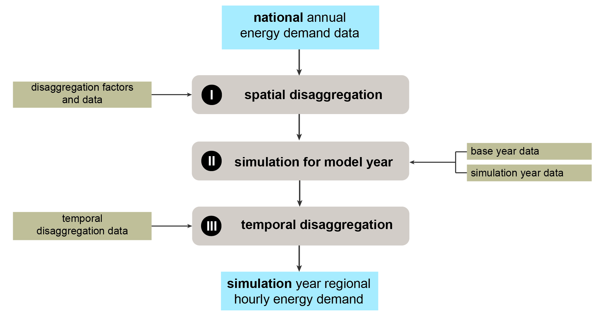
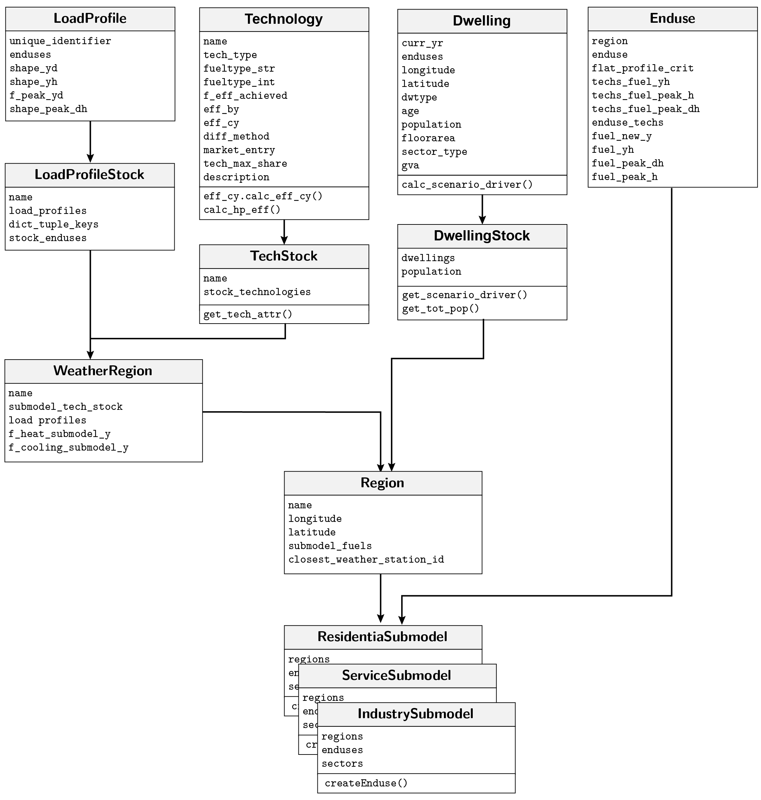
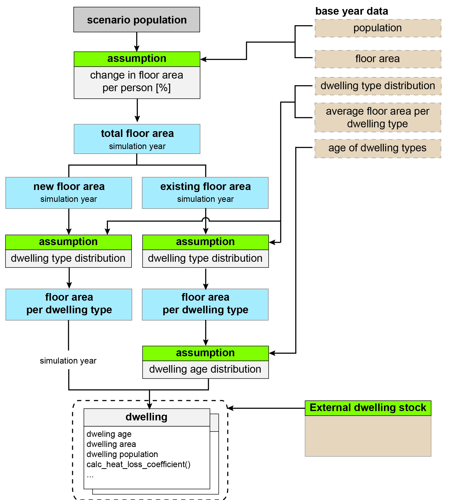
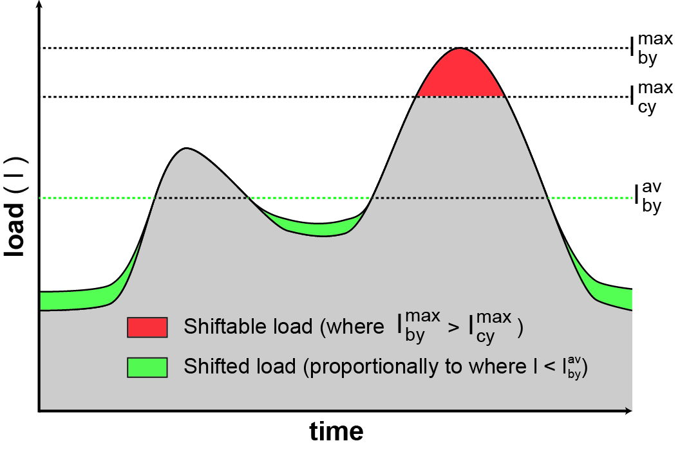
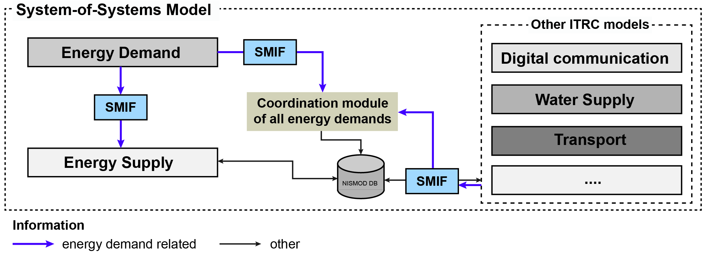
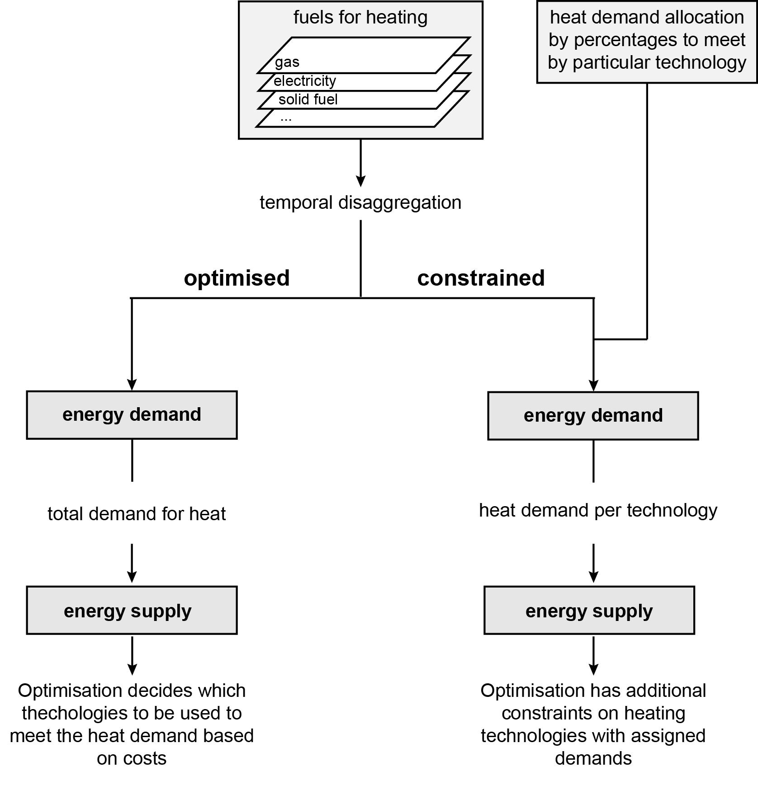

Documentation
===================

This is the documention of the High-Resolution Energy demand model
(HIRE) of the ITRC-MITRAL framework.

## 1. Introduction

HIRE allows the simulation of long-term changes in energy demand patterns
for the residential, service and industry sector on a high temporal
and spatial scale. National end-use specific energy demand data is
disaggregated on local authority district level and a bottom-up approach
is implemented for hourly energy demand estimation for different fuel types
and end uses.Future energy demand is simulated based on different
socio-technical scenario assumptions such as technology efficiencies,
changes in the technological mix per end use consumptions or behavioural change.
Energy demand is simulated in relation to changes in scenario drivers of the
base year. End-use specific socio-technical drivers for energy demands
modelled where possible on a household level.

     
  The methodology is fully published in Eggimann et al. 2018: TBD,
  [DOI](http://www.linktodoi.com).

## 2. Overview

### 2.1 Simulated end uses and sectors

Within HIRE, residential, service and industrial energy demands are
modelled for three main sub-modules. For the United Kingomd,
each sub module modelles end uses and sectors taken from
BEIS (2016). A simplified overview is given in Figure 1.

*Figure 1: Simplified overview of modelled end uses and sectors*

A complete list of all modelled end uses and sectors is provided in
Table 2.1. As HIRE is highly modular, all end uses or sectors can be 
replaced with different end uses depending on available energy
consumption statistics. 

More information on sectors and their fuel inputs can be found [here](https://www.gov.uk/government/uploads/system/uploads/attachment_data/file/573271/ECUK_user_guide_November_2016_final.pdf).

<table align="center">
  <tr>
    <th align="left">Residential</th>
    <th align="left">Service</th>
    <th align="left">Industry</th>
  </tr>
  <tr>
    <td>&nbsp</td>
    <td>&nbsp</td>
    <td>&nbsp</td>
  </tr>
  <tr>
    <td><b>End use</b></td>
    <td><b>End use</b></td>
    <td><b>End use</b></td>
  </tr>
  <tr>
    <td>space heating</td>
    <td>space heating</td>
    <td>space heating</td>
  </tr>
  <tr>
    <td>water heating</td>
    <td>water heating</td>
    <td>drying and separation</td>
  </tr>
  <tr>
    <td>lighting</td>
    <td>lighting</td>
    <td>lighting</td>
  </tr>
  <tr>
    <td>cooking</td>
    <td>catering</td>
    <td>motors</td>
  </tr>
  <tr>
    <td>cold</td>
    <td>cooling and humidification</td>
    <td>refrigeration</td>
  </tr>
  <tr>
    <td>home computing</td>
    <td>ICT equipment</td>
    <td>compressed air</td>
  </tr>
  <tr>
    <td>consumer electronics</td>
    <td>fans</td>
    <td>high temperature processes</td>
  </tr>
  <tr>
    <td>wet</td>
    <td>small power</td>
    <td>low temperature processes</td>
  </tr>
  <tr>
    <td>&nbsp</td>
    <td>other gas</td>
    <td>other</td>
  </tr>
  <tr>
    <td>&nbsp</td>
    <td>other electricity</td>
    <td>&nbsp</td>
  </tr>
  <tr>
    <td>&nbsp</td>
    <td>cooled storage</td>
    <td>&nbsp</td>
  </tr>
  <tr>
    <td>&nbsp</td>
    <td>&nbsp</td>
    <td>&nbsp</td>
  </td>
  <tr>
    <td><b>Sector</b></td>
    <td><b>Sector</b></td>
    <td><b>Sector</b></td>
  </tr>
  <tr>
    <td>&nbsp</td>
    <td>Community, arts and leisure</td>
    <td>Other mining and quarrying</td>
  </tr>
  <tr>
    <td>&nbsp</td>
    <td>Education</td>
    <td>Manufacture of food products</td>
  </tr>
  <tr>
    <td>&nbsp</td>
    <td>Emergency Services</td>
    <td>Manufacture of beverages</td>
  </tr>
  <tr>
    <td>&nbsp</td>
    <td>Health</td>
    <td>Manufacture of tobacco products</td>
  </tr>
  <tr>
    <td>&nbsp</td>
    <td>Hospitality</td>
    <td>Manufacture of textiles</td>
  </tr>
  <tr>
    <td>&nbsp</td>
    <td>Military</td>
    <td>Manufacture of wearing apparel</td>
  </tr>
  <tr>
    <td>&nbsp</td>
    <td>Offices</td>
    <td>Manufacture of leather and related products</td>
  </tr>
  <tr>
    <td>&nbsp</td>
    <td>Retail</td>
    <td>Manufacture of wood related products</td>
  </tr>
  <tr>
    <td>&nbsp</td>
    <td>Storage</td>
    <td>Manufacture of paper and paper products</td>
  </tr>
  <tr>
    <td>&nbsp</td>
    <td>&nbsp</td>
    <td>Printing and publishing of recorded media and other publishing activities</td>
  </tr>
  <tr>
    <td>&nbsp</td>
    <td>&nbsp</td>
    <td>Manufacture of chemicals and chemical products</td>
  </tr>
  <tr>
    <td>&nbsp</td>
    <td>&nbsp</td>
    <td>Manufacture of basic pharmaceutical products  and pharmaceutical preparations</td>
  </tr>
  <tr>
    <td>&nbsp</td>
    <td>&nbsp</td>
    <td>Manufacture of rubber and plastic products</td>
  </tr>
  <tr>
    <td>&nbsp</td>
    <td>&nbsp</td>
    <td>Manufacture of other non-metallic mineral products</td>
  </tr>
  <tr>
    <td>&nbsp</td>
    <td>&nbsp</td>
    <td>Manufacture of basic metals</td>
  </tr>
  <tr>
    <td>&nbsp</td>
    <td>&nbsp</td>
    <td>Manufacture of fabricated metal products,  except machinery and equipment</td>
  </tr
    <tr>
    <td>&nbsp</td>
    <td>&nbsp</td>
    <td>Manufacture of computer, electronic and optical products</td>
  </tr>
  <tr>
    <td>&nbsp</td>
    <td>&nbsp</td>
    <td>Manufacture of electrical equipment</td>
  </tr>
  <tr>
    <td>&nbsp</td>
    <td>&nbsp</td>
    <td>Manufacture of machinery and equipment n.e.c.</td>
  </tr>
  <tr>
    <td>&nbsp</td>
    <td>&nbsp</td>
    <td>Manufacture of motor vehicles,  trailers and semi-trailers</td>
  </tr>
  <tr>
    <td>&nbsp</td>
    <td>&nbsp</td>
    <td>Manufacture of other transport equipment</td>
  </tr>
  <tr>
    <td>&nbsp</td>
    <td>&nbsp</td>
    <td>Manufacture of furniture</td>
  </tr>
  <tr>
    <td>&nbsp</td>
    <td>&nbsp</td>
    <td>Other manufacturing</td>
  </tr>
  <tr>
    <td>&nbsp</td>
    <td>&nbsp</td>
    <td>Water collection, treatment and supply</td>
  </tr>
  <tr>
    <td>&nbsp</td>
    <td>&nbsp</td>
    <td>Waste collection, treatment and disposal  activities; materials recovery</td>
  </tr>
</table>

*Table 2.1: Complete overview of modelled submodels, enduses and sectors for the United Kingdom.*

### 2.2 Work flow

The main working steps as outlined in Figure 2 are explained in full
detail in Eggimann et al. (2018). 

*Figure 2: Overview of modelled end uses and sectors*

#### 2.2.1 I Step - Spatial disaggregation
As a starting point, national based energy demand consumption statistics
are disaggregated to regional energy demands. This is performed with
disaggregation factors such as population, heating degree day calculations
or employment statistics. In case regional data is available, this step 
can be omitted.

#### 2.2.2 II Step - Demand simulation
Total energy demand of a (simulation) year () is calculated over all regions (r), sectors (s), end-uses (e), technologies (t) and fuel-types (f) as follows:

 \right) \right) \right )\right)")

: Demand change related to change in scenario driver (SD)

: Demand change related to change in technology efficiency

:Demand change related to change in technology mix

: Demand change related to change in climate

: Demand change related to change in behaviour (e.g. smart meter, base temperatures)

Energy demand change in relation to the base year (by) for end-use specific scenario drivers is defined as follows: 

The individual terms are fully described in Eggimann et al. (2018).

For the residential and service sub model, SD values are calculated based on a dwelling stock where scenario drivers are calculated either for dwellings or a group of dwelling (e.g. dwelling types).

<table align="center">
  <tr>
    <th align="left">Scenario Driver</th>
    <th align="left">Enduse(s)</th>
  </tr>
  <tr>
    <td>Floor Area</td>
    <td>Space heating, lighting</td>
  </tr>
  <tr>
    <td>Heating Degree Days</td>
    <td>Space heating</td>
  </tr>
  <tr>
    <td>Cooling degree Days</td>
    <td>Cooling and Ventilation</td>
  </tr>
    <tr>
    <td>Population</td>
    <td>Water heating, cooking, appliances ...</td>
  </tr>
    <tr>
    <td>GVA</td>
    <td>Enduses in industry submodel, appliances</td>
  </tr>
</table>

*Table 1.1: End-use specific scenario drivers for energy demand*

#### 2.2.3 III Step - Temporal disaggregation
In order to disaggregate annual demand for every hour in a year,
different typical load profiles are derived from measuremnt trials. 
Load profile are either used to disaggregate total demand of an 
end use, sector or technology specific end use energy demand.

Only the profile (i.e. the 'shape') is loaded as an input into the model.
In case of temperature dependent load profiles, the daily load profils
are calculated with help of heating and cooling degree days (HDD, CDD).

For different heating technologies, load shares are derived from the
following sources:

- **Heat pumps load profile**
   Based on nearly 700 domestic heat pump installations,
   Love et al. (2017) provides aggregated profiles for cold
   and medium witer weekdays and weekends. The shape of the
   load profiles is derived for a working, weekend and peak day.

- **Boiler load profile**
   Load profiles for a typicaly working, weekend and peak day
   are derived from data provided by Sansom (2014).

- **Micro-CHP**
   Load profiles for a typicaly working, weekend and peak
   day are derived from data provided by Sansom (2014).

- **Primary and secondary electric heating**
  The load profiles are based on the Household Electricity
  Survey (HES) by the Department of Energy & Climate Change (DECC, 2014).

- **Cooling**
  The daily load profiles for service submodel cooling demands are taken
  from Dunn and Knight (2005).

### 2.3 Main Classes
Figure 3 provides an overview of how all major classes relate to each other
for generating a sub model to simluate different end uses.
For every simulated region, the geographically
closeset `WeatherRegion` is searched and linked to the `Region` class. 
Every `WeatherRegion` class contains a technology and load profile stock
as depending on temperatures, the efficiencies of the technologies
and load profiles may differ.

*Figure 3: Interaction of all major classes of HIRE*

## 3 Methods
In this section, selected aspects of the methodology are explained
in more detail.

### 3.1 Generic dwelling stock
A generic dwelling model is implemented in HIRE which can be used
in case no external dwelling stock model is available to generate
provide the necessary ``dwelling`` inputs. An abstracted dwelling
representation is modelled with the following assumptions for
the base year configuration:

  •	total population
  •	total floor area
  •	dwelling type distribution
  •	age distribution of dwelling types

However, instead of modelling every individual building, an abstracted
dwelling representation of the the complete dwelling stock is modelled
based on different simplified assumptions. The modelling steps are as
follows for every ``Region`` (see Figure XX for the detailed process flow):

1. Based on base year total population and total floor area, the floor
area per person is calculated (``floor_area_pp``). The floor area per
person can be changed over the simulation period.

2. Based on the floor area per person and scenario population input, total
necessary new and existing floor area is calculated for the simulation
year (by subtracting the existing floor area of the total new floor area).

3. Based on assumptions on the dwelling type distribution (``assump_dwtype_distr``)
the floor area per dwelling type is calculated.

4. Based on assumptions on the age of the dwelling types, different ``Dwelling``
objects are generated. The heat loss coefficient is calculated for every object.

5. Additional dwelling stock related properties can be added to
the ``Dwelling`` objects which give indication of the energy
demand and can be used for calculating the scenario drivers.

Note: Current floor area data can be calculated based on
floor area data from MasterMap data in combination with the
address point dataset by the Ordonance Survey.

*Figure 4: Modelling steps of the residential dwelling module*

### 3.2 Demand side management
Dirunal demand side responses per end use are modelled with help of load factors (Petchers, 2003). For every end use, a potential (linear) reduction of the load factor over time can be assumed with which the load factor of the current year is calculated . With help , and the daily average load of the base year , the maximum hourly load per day is calculated as follows:

For all hours with loads higher than the new maximum hourly load, the shiftable load is distributed to all off-peak load hours as shown in Figure XY.

*Figure 5: Shifting loads from peak hours to off-peak hours based on load factor changes.*

### 3.3 Technologies, technological diffusion
For every end use, technologies can be defined. For the 
UK application, the defined technologies are listed in Table 2.

<table align="center">
  <tr>
    <th align="left">End use</th>
    <th align="left">Technologies</th>
  </tr>
  <tr>
    <td>Wet</td>
    <td>Washing machine, tubmle dryer, dishwasher, washer dryer</td>
  </tr>
  <tr>
    <td>Cooking</td>
    <td>Oven, Standard hub (different fueltypes), Induction hob</td>
  </tr>
  <tr>
    <td>Cold</td>
    <td>Chest freezer, Fridge freezer, Refrigerator, Upright freezer</td>
  </tr>
    <tr>
    <td>Lighting</td>
    <td>Light bulb (incandescent), Halogen, Light saving, Fluorescent, LED</td>
  </tr>
    <tr>
    <td>Heating</td>
    <td>Boiler (different fueltypes), Condensing boiler, ASHP, GSHP, Micro-CHP, Fuel cell, Storage heating, Night storage heater, Heat network generation technologies (CHP,...)</td>
</table>

*Table 2: Technology assignement to end uses*

### 3.4 System-of-system embedding
The main function of HIRE within the MISTRAL modelling framework is to provide energy demands
to the energy supply model developped within this framwork (see Figure 6).

*Figure 6: Visualisation of System-of-system model integration*

This can be achieved in two ways, either demands are provided
for an optimised or constrained model mode. In the constrained mode, heat demand
is allocated to certain heating technologies and converted into respective fuel carriers.
For the unconstrained mode, the energy supply model assigns technologies to meet the given
heat demand, which is directly provided from the demand model to the supply model (see Figure 7)

*Figure 7: Interaction of energy demand and supply model*

## 4 Data sets

This section provides an overview of all used datasets in HIRE and necessary data preparation.

### 4.1 National Energy Statistics
The base year final energy consumption of the UK in terms of fuels and technology shares for the residential, service and industry sectors is taken from the Department for Business, Energy and Industrial Strategy ([BEIS, 2016](https://www.gov.uk/government/collections/energy-consumption-in-the-uk)). National final energy data is provided for different fuelt types in the unit of ktoe (tonne of oil equivalents). All energy unit conversions are based on the unit converter by the International Energy Agency ([IEA, 2017](http://www.iea.org/statistics/resources/unitconverter)).

Even though sub-national data for gas and electricity consumption are [available](https://www.gov.uk/government/uploads/system/uploads/attachment_data/file/541163/ECUK_2016.pdf) from BEIS, they do not provide the same level of differentiation with respect to distinguishing between different endues or sectors.

### 4.2 Household Electricity Servey (DECC 2014)
The [Household Electricity Survey (HES)](https://www.gov.uk/government/collections/household-electricity-survey)
by the Department of Energy & Climate Change (DECC 2014) is the most detailed monitoring
of electricity use carried out in the UK. Electricity consumption was monitored
at an appliance level in 250 owner-occupied households across England from 2010 to 2011.
From the provided spreadsheet for users (DECC 2017), peak load profiles and averaged monthly data
are available for a sample of 250 households on a 10 minutes basis. The data are aggregated
to hourly resolution to derive hourly load profiles for the full year.

The load profiles for different residential enduses for
different daytypes (weekend, working day) are taken from a [24 hour spreadsheet tool](https://www.gov.uk/government/publications/spreadsheet-tools-for-users).

### 4.3 Carbon Trust advanced metering trial
The [Carbon Trust (2007)](http://data.ukedc.rl.ac.uk/simplebrowse/edc/efficiency/residential/Buildings/AdvancedMeteringTrial_2006/) advanced metering trial dataset contains hourly electricity and gas demand measurements for different service (business) sectors from over 500 measurement sites broken down in sectors. The Carbon Trust data does not allow distinguishing between different end uses within each sector. According to the dominant fuel type of each end use,either aggregated gas or sector specific load profiles are therefore assigned. For ‘water heating’, ‘space heating’ and the ‘other_gas_enduse’, all gas measurements across all sectors are used, because the sample size was too small. For all other end uses, sector specific electricity load profiles are assigned. The provided sectors in the data trial do not fully correspond to the ECUK sectors (see Table 5) and where a sector is missing,the aggregated profiles across all sectors are used.

<table align="center">
  <tr>
    <th align="left">ECUK Data (Table 5.05)</th>
    <th align="left">Carbon Trust Dataset</th>
  </tr>
  <tr>
    <td>Community, arts and leisure</td>
    <td>Community</td>
  </tr>
  <tr>
    <td>Education</td>
    <td>Education</td>
  </tr>
  <tr>
    <td>Emergency Services</td>
    <td>Aggregated across all sectors</td>
  </tr>
    <tr>
    <td>Health</td>
    <td>Health</td>
  </tr>
    <tr>
    <td>Hospitality</td>
    <td>Aggregated across all sectors</td>
  </tr>
    <tr>
    <td>Military</td>
    <td>Aggregated across all sectors</td>
  </tr>
    <tr>
    <td>Offices</td>
    <td>Offices</td>
  </tr>
    <tr>
    <td>Retail</td>
    <td>Retail</td>
  </tr>
    <tr>
    <td>Storage</td>
    <td>Aggregated across all sectors</td>
  </tr>
</table>

*Table 5: Matching sectors from the ECUK dataset and sectors from the Carbon Trust dataset*

Yearly load profiles are generated based on averaging measurements for every month and day type (weekend, working day). Only the yearly load profile for space heating is generated based on HDD calculations.

Data preparation of the raw input files was necessary:
*	Half-hourly data was converted into hourly data
*	Within each sector, only datasets containing at least one full year of monitoring data are used, from which only one full year is selected
*	Only datasets having not more than one missing measurement point per day are used
*	The data was cleaned from obviously wrong measurement points (containing very large minus values)
*	missing measurement points are interpolated 

### 4.4 Temperature data
To calculate regional daily hourly load heating profiles, hourly temperature data are used from the [UK Met Office (2015)](http://catalogue.ceda.ac.uk/uuid/220a65615218d5c9cc9e4785a3234bd0) and loaded for weather stations across the UK.

- The station ID can be retreived [here](http://badc.nerc.ac.uk/cgi-bin/midas_stations/search_by_name.cgi.py?name=&minyear=&maxyear=)
- Metadatda of raw data can be found [here](http://artefacts.ceda.ac.uk/badc_datadocs/ukmo-midas/WH_Table.html)

Alternatively, daily minimum and maximum temperature data can be downloaded from the [ weather@home dataset](https://catalogue.ceda.ac.uk/uuid/0cea8d7aca57427fae92241348ae9b03).

### 4.5 Census data
Employment statistics from the census (Office for National Statistics 2011)
are used to disaggregate industry related energy demands for different end uses and sectors.

- The data download link can be found [here](http://catalogue.ceda.ac.uk/uuid/916ac4bbc46f7685ae9a5e10451bae7c)

## Literature

BEIS (2016): Energy consumption in the UK (ECUK). London, UK. Retrieved from: [https://www.gov.uk/government/collections/energy-consumption-in-the-uk](https://www.gov.uk/government/collections/energy-consumption-in-the-uk)

Carbon Trust (2007). Advanced metering for SMEs Carbon and cost savings. Retrieved from
   [https://www.carbontrust.com/media/77244/ctc713_advanced_metering_for_smes.pdf](https://www.carbontrust.com/media/77244/ctc713_advanced_metering_for_smes.pdf)

DECC (2014) Household Electricity Survey. Retrieved from:[https://www.gov.uk/government/collections/household-electricity-survey](https://www.gov.uk/government/collections/household-electricity-survey)

Dunn, G. N. and Knight, I. P. (2005) ‘Carbon and Cooling in Uk Office Environments’, in Proceedings of the 10th International Conference Indoor Air Quality and Climate. Beijing, China, p. 6. Available at: http://www.cardiff.ac.uk/archi/research/auditac/pdf/auditac_carbon.pdf.

Love, J., Smith, A. Z. P., Watson, S., Oikonomou, E., Summerfield, A., Gleeson, C., … Lowe, R. (2017). The addition of heat pump electricity load profiles to GB electricity demand: Evidence from a heat pump field trial. Applied Energy, 204, 332–342. [https://doi.org/10.1016/j.apenergy.2017.07.026](https://doi.org/10.1016/j.apenergy.2017.07.026)

Petchers, N. (2003) Combined heating, cooling & power handbook: technologies & applications. 2 edition. Lilburn: Fairmont Press.

Sansom, R. (2014). Decarbonising low grade heat for low carbon future. Imperial College London.

UK Met Office (2015): ‘MIDAS: UK hourly weather observation data’. Centre for Environmental Data Analysis. Retrieved from: [http://catalogue.ceda.ac.uk/uuid/916ac4bbc46f7685ae9a5e10451bae7c](http://catalogue.ceda.ac.uk/uuid/916ac4bbc46f7685ae9a5e10451bae7c).

Code Overview
===================

This section provides and overview how the model code is stored.

Some model input data used to configure the model is stored in the 
`config_data` folder (i.e. load profiles of technologies,
fuel input data for the whole UK). All additional data
necessary to run the model needs to be stored in
a local folder (`data_energy_demand`).

The python scripts are stored in the following folders:

- **assumptions** | Model assumptions which need to be configured 
- **basic** | Standard functions
- **charts** | Functions to generate charts
- **cli** | Script to run model from command line
- **config_data** | Configuration data (e.e.g technologies, fuel)
- **dwelling_stock** | Dwelling stock related functions
- **geography** | Space related functions (e.g. weather region)
- **initalisations** | Initialisation scripts
- **plotting** | All plotting functionality
- **profiles** | Load profile related functionality
- **read_write** | Reading and writing functions
- **script** | Scripts
- **technologies** | Technology related funcionality
- **validation** | Validation related scripts

Important single python scripts:

- **main.py**     - Function to run model locally
- **enduse_func** - Main enduse function
- **model**       - Main model function

Within the code, different abbreviations are consistenly used
across all modules.

    s:         Energy service
    rs:         Residential Submodel
    ss:         Service Submodel
    is:         Industry Submodel

    by:         Base year
    cy:         Current year
    lp:         Load profile
    dw:         Dwelling
    p:          Decimal (100% = 1.0)
    pp:         Per person
    lu:         Look-up

    e:          Electricitiy
    g:          Gas
  
    h:          Hour
    d:          Day
    y:          Year
    yh:         8760 hours in a year
    yearday:    Day in a year ranging from 0 to 364

    hp:         Heat pump
    tech:       Technology
    temp:       Temperature

Different endings are appended to variables, depending on the temporal
resolution of the data. The following abbreviations hold true:

> `y`:  Total demand in a year

> `yd`: 'Yearly load profile' - Profile for every day in a year of total yearly demand(365)

> `yh`: 'Daily load profile'  - Profile for every hour in a year of total yearly demand (365, 24)

> `dh`: Load profile of a single day

> `y_dh`: Daily load profile within each day (365, 25). Within each day, sums up to 1.0
